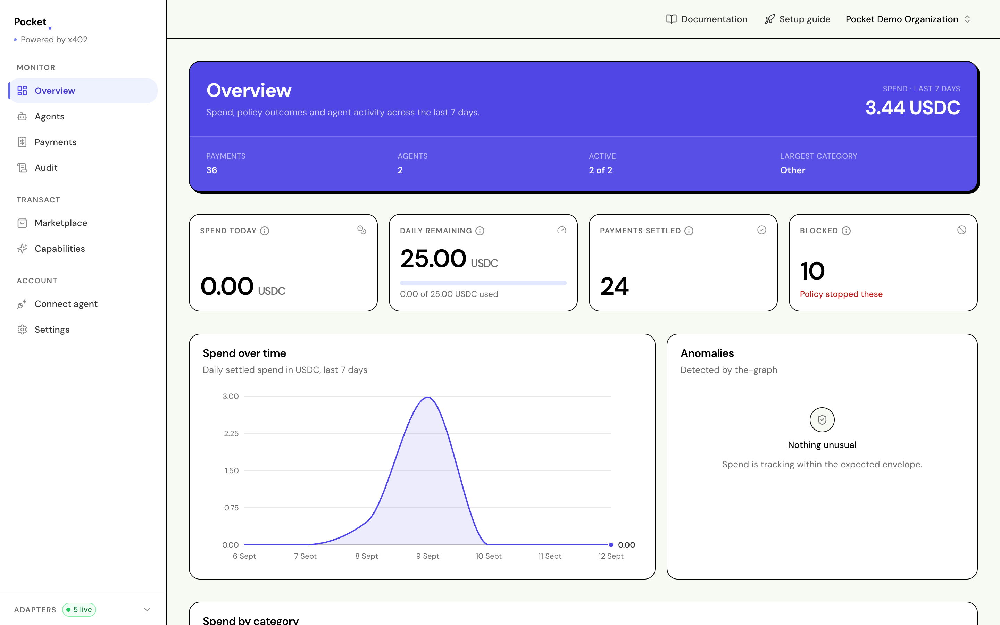

<div align="center">

# Pocket

**Spending limits for AI agents.**

Give each agent its own wallet and a hard cap it cannot raise.

[Documentation](https://docs.pocket-app.xyz/docs) ·
[Quickstart](https://docs.pocket-app.xyz/docs/quickstart) ·
[How it works](https://docs.pocket-app.xyz/docs/how-it-works)



</div>

---

An agent asks for a paid resource. The seller answers `402 Payment Required`.
Pocket decides whether that money may be spent, and only then does a wallet
sign for it. The agent never holds a key, and a refusal is recorded with the
rule that stopped it.

## Where everything lives

| Service          | Address                                                      | What it is                                                 |
| ---------------- | ------------------------------------------------------------ | ---------------------------------------------------------- |
| **Dashboard**    | [www.pocket-app.xyz](https://www.pocket-app.xyz)             | Where a human sets budgets and reads the record            |
| **Docs**         | [docs.pocket-app.xyz/docs](https://docs.pocket-app.xyz/docs) | The documentation site                                     |
| **API**          | [api.pocket-app.xyz](https://api.pocket-app.xyz)             | The policy engine, ledger and audit trail                  |
| **MCP server**   | [mcp.pocket-app.xyz/mcp](https://mcp.pocket-app.xyz/mcp)     | How an agent reaches Pocket, over Model Context Protocol   |
| **Paid service** | [pay.pocket-app.xyz](https://pay.pocket-app.xyz)             | An independent x402 seller, so the demo is a real purchase |

The three backend services answer `GET /` with a JSON description of
themselves: what they do and which build is running. The MCP server lists its
tools there, and the seller lists its priced endpoints. The dashboard and the
docs site serve pages, so theirs is a page.

## Run it locally

```bash
pnpm install
docker compose up -d
cp .env.example .env
pnpm db:push
./run-dev.sh
pnpm dev:dashboard
```

Then open `http://localhost:3000` and sign in. Your organization, its first API
key and an agent with a funded wallet all come from the setup guide on screen.

Running it against real Privy, Hedera and The Graph credentials is covered in
[`setup/`](setup/README.md), one guide per vendor. Each is independent of the
other two.

## The repository

| Path                | What is in it                                              |
| ------------------- | ---------------------------------------------------------- |
| `apps/api`          | HTTP API: policy decisions, payments, audit trail          |
| `apps/dashboard`    | Next.js dashboard and the marketing page                   |
| `apps/docs`         | The documentation site                                     |
| `apps/mcp`          | MCP server, eight tools, one of which can spend            |
| `apps/paid-service` | The example x402 seller                                    |
| `packages/core`     | Pure domain logic: money, budgets, policy decisions        |
| `packages/db`       | Schema and repositories                                    |
| `packages/adapters` | Privy, Hedera and The Graph, behind ports                  |
| `subgraph`          | The indexer that reads settled payments back off the chain |
| `setup`             | Wiring Privy, Hedera and The Graph to real credentials     |

Each app carries its own README.

The API describes its own surface. `GET /` on any service lists every endpoint
it serves, and one rule holds across all of them: money is always a decimal
string beside its asset, never a JSON number.

## Contributing and security

[CONTRIBUTING.md](CONTRIBUTING.md) covers the workflow and what CI will check.
[SECURITY.md](SECURITY.md) covers reporting a vulnerability. Please do not open
a public issue for one.

## Licence

[Business Source License 1.1](LICENSE). Read it, run it, change it, and use it
internally. You may not offer it to third parties as a hosted or managed
service.
